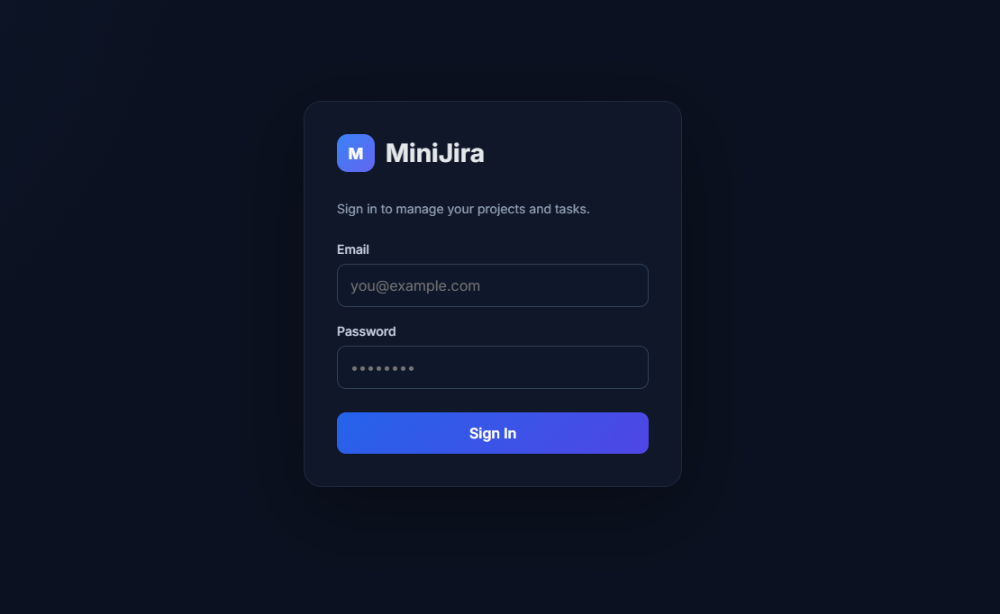
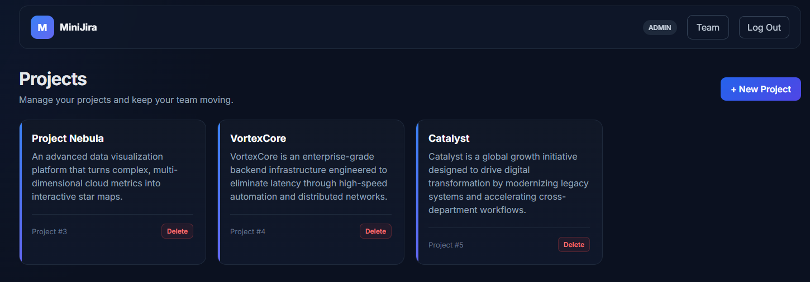
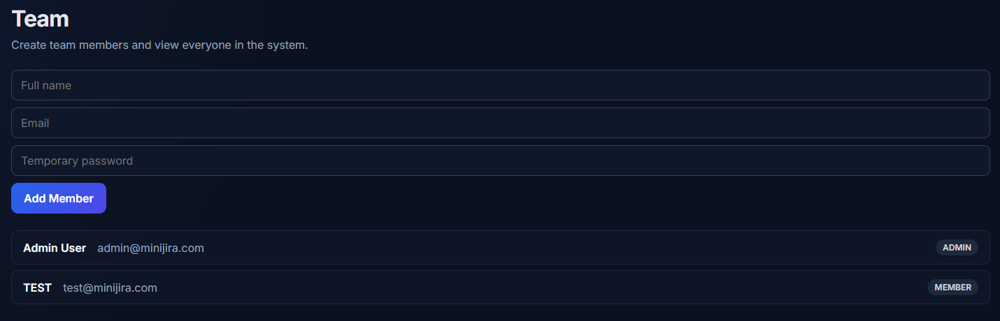
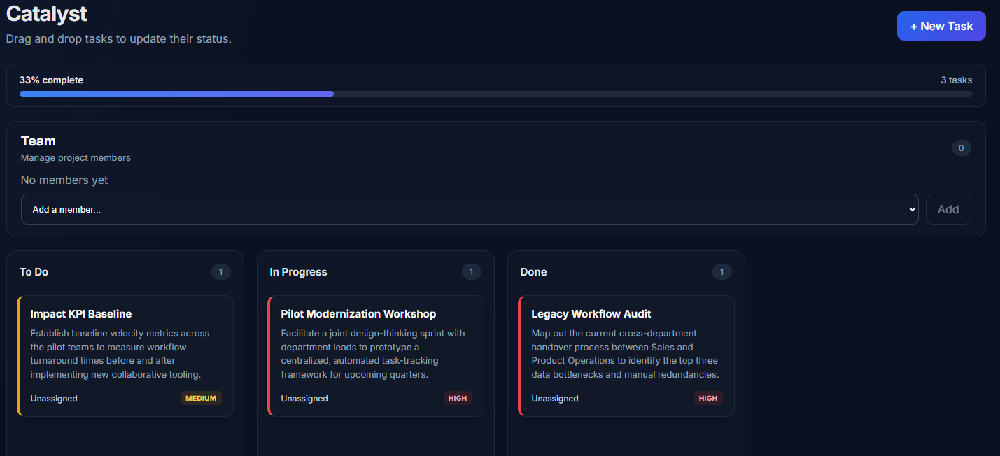

# MiniJira

A full-stack task and project management system inspired by tools like Jira. Built to demonstrate production-style backend architecture, secured REST APIs, and a modern React frontend with real-time drag-and-drop.

---

## 📸 Screenshots/GIF









---
## 🗺️ Overview

Mini-Jira lets teams organize work across projects:

* **Admins** create projects and add team members
* **Members** get assigned tasks within projects they belong to
* Tasks move through a Kanban board (To Do → In Progress → Done) via drag-and-drop
* Users can comment on tasks for collaboration
* Everything is secured with JWT-based, role-based authentication (Admin / Member)

This project was built in phases — backend foundation, business logic + testing, security, and frontend — with each phase committed incrementally rather than as one large drop.

---
## 🚀 Features

### 🔐 Authentication & Security
* **Role-Based Access Control:** Secure **JWT login** alongside **BCrypt hashing** for passwords.
* **Enforced Permissions:** **Admin vs. Member permissions** strictly enforced at both the URL level (`SecurityConfig`) and method level (`@PreAuthorize`).

### 📂 Project & Member Management
* **Lifecycle Tracking:** Complete **CRUD operations** on projects including ownership tracking and structural relational modeling.
* **Cascading Deletions:** Safe deletion handles edge cases. Deleting a project **cascades to its tasks and comments**.
* **Automatic Un-assignment:** Removing a member from a project **automatically un-assigns** them from tasks within that project to maintain system integrity.

### 📋 Task Management & Collaboration
* **Full Domain CRUD:** Complete control over tasks and threaded comment streams without relying on external API tools like Postman.
* **Business Rule Validation:** Strict enforcement ensures data integrity. Tasks can **only be assigned to project members**, backed by scoped frontend dropdowns and backend validation.
* **Granular Control:** Complete task tracking featuring **priority indicators, due dates, and custom filtering**.

### 🎛️ Interactive Kanban Board & UI
* **Drag-and-Drop Workflow:** Seamless task transitions across status states (*To Do, In Progress, Done*) featuring a lifted drag-overlay animation.
* **Optimistic UI Updates:** Instant visual feedback on the frontend that triggers an **automatic rollback** if the backend API call fails.
* **Progress Tracking:** A **live progress bar** showing real-time completion percentages and task counts by status, updating dynamically after every action.

### 🛡️ Robust Architecture & Testing
* **Clean Error Handling:** A **Global Exception Handler** processes runtime errors (400, 401, 404, 409) into structured JSON responses rather than raw stack traces.
* **Deep Test Coverage:** Robust service-layer validation built using **JUnit and Mockito**, covering happy paths, edge cases, and business rule violations.

---

## 🛠️ Tech Stack


| Layer | Technology                                                                                         |
| :--- |:---------------------------------------------------------------------------------------------------|
| **Backend** | Java, Spring Boot, Spring Security, Spring Data JPA, Maven, Hibernate                              |
| **Auth** | JWT (jjwt), BCrypt password hashing, role-based access control                                     |
| **Database** | MySQL                                                                                              |
| **Testing** | JUnit 5, Mockito                                                                                   |
| **Frontend** | React (Vite), React Router, Axios, `@dnd-kit`                                                      |
| **Tooling** | Git, GitHub, Postman, ESLint                                                                       |
| **Deployment** | AWS EC2 (Ubuntu 22.04, t2.micro), nginx reverse proxy, systemd                                     |


---

## 🏗️ Project Architecture

### Project Structure

The project is split into separate backend and frontend repositories:

```text
D:\PROJECTS\
├── minijira/           # Spring Boot backend
└── minijira-frontend/  # React frontend
```

#### 📁 Backend Layout
```text
src/
├── main/
│   ├── java/com/vinayak/minijira/
│   │   ├── config/       # Configurations (Security, CORS)
│   │   ├── controller/   # REST Controllers (Thin layer)
│   │   ├── dto/          # Data Transfer Objects
│   │   ├── entity/       # Database Entities
│   │   ├── enums/        # Global Enums (Priorities, Roles)
│   │   ├── exception/    # Global Error Handling
│   │   ├── repository/   # JPA Repositories
│   │   ├── security/     # JWT & Authentication Filters
│   │   └── service/      # Business Logic (Isolated)
│   └── resources/
│       └── application.properties
└── test/                 # JUnit & Mockito Unit Tests
```

#### 📁 Frontend Layout
```text
src/
├── api/        # Axios configurations & API services
├── components/ # Reusable UI elements & Protected routes
├── context/    # Global Auth State Management
├── pages/      # View pages (Login, Dashboard, Board)
├── App.jsx     # Main Router
├── index.css   # Styles
└── main.jsx    # Application Entry point
```

### Architecture Notes

The backend follows a standard layered architecture:

```text
Controller ➔ Service ➔ Repository ➔ Database
```

* **Separation of Concerns:** Business logic lives exclusively in the service layer. Controllers stay thin, and repositories stay dumb. This maximizes testability using mocked repositories.
* **Database Relations:**
  * **One-to-Many:** Project ➔ Tasks, Task ➔ Comments
  * **Many-to-One:** Task ➔ Assignee, Comment ➔ Author
  * **Many-to-Many:** Project ↔ Members

---
## ⚙️ Getting Started

### Backend

**Requirements:** Java 17+, Maven, MySQL

1. Create the database:

```sql
CREATE DATABASE minijira;
```

2. Configure `src/main/resources/application.properties`:

```properties
spring.datasource.url=jdbc:mysql://localhost:3306/minijira
spring.datasource.username=root
spring.datasource.password=yourpassword
spring.jpa.hibernate.ddl-auto=update
jwt.secret=<your-base64-encoded-secret>
```

3. Run the app:

```bash
mvn spring-boot:run
```
4. On first run, a default admin user is seeded automatically:

```
Email: admin@minijira.com
Password: admin123
```

Log in with these credentials to get a JWT, then use that token to create additional users/projects through the API. (There is intentionally no open "create admin" endpoint — see Security Notes below for why.)

### Frontend

**Requirements:** Node.js 18+

```bash
cd minijira-frontend
npm install
npm run dev
```

The app runs at `http://localhost:5173` and expects the backend at `http://localhost:8080`.

---

## 📡 Current APIs

### 🌐 API Endpoints

| Method | Endpoint | Access / Notes |
| :--- | :--- | :--- |
| **POST** | `/api/auth/login` | Public |
| **GET / POST** | `/api/users` | Public* |
| **GET / POST** | `/api/projects` | Authenticated |
| **DELETE** | `/api/projects/{id}` | Admin only — *cascades to the project's tasks and comments* |
| **POST** | `/api/projects/{id}/members` | Authenticated |
| **DELETE** | `/api/projects/{id}/members/{userId}` | Admin only — *also un-assigns that user's tasks in the project* |
| **GET / POST** | `/api/tasks` | Authenticated |
| **GET** | `/api/tasks/project/{projectId}/summary` | Authenticated — *returns status counts + percent complete* |
| **PATCH** | `/api/tasks/{id}/status` | Authenticated |
| **PATCH** | `/api/tasks/{id}/assign` | Authenticated |
| **DELETE** | `/api/tasks/{id}` | Authenticated |
| **GET / POST** | `/api/comments` | Authenticated |


--- 
## 🧪 Testing

### Testing & Quality Assurance

A full Postman collection (including negative/role-denial test cases) is included in the `/postman` directory.

#### 🟢 Backend Unit Tests
Execute the test suite using the Maven wrapper:
```bash
.\mvnw.cmd test
```
**Coverage includes:**
* **Business Logic:** Task business rules, default status assignments, and missing entity edge cases (project/task/user).
* **Comments:** Validation of comment creation and not-found handling.
* **Security:** JWT generation, cryptographic validation, expired token rejection, and tampered payload detection.

#### 🎯 API & Postman Testing
The endpoint validation strategy covers:
* **Authentication:** Login flows and proper token generation.
* **Access Control:** Restricted endpoint access and explicit **ADMIN vs. MEMBER** authorization boundaries.
* **Error Resilience:** Input validation errors and garbage/malformed JWT rejection.
* **Core Features:** End-to-end task mutations, comment tracking, and Kanban status updates.

#### 💻 Frontend End-to-End Testing
The complete user workflow has been verified end-to-end:

```text
Login ➔ JWT Stored ➔ Projects Loaded ➔ Project Opened ➔ Tasks Loaded
                                                            │
                                                            ▼
Status Persisted ➔ Page Refreshed ➔ PATCH to Backend ➔ Task Dragged
```

---
## 🛡️ Security Architecture

* **Password Hashing:** Passwords are fully hashed via **BCrypt** before persistence; plain text is never stored.
* **Stateless Auth:** Implements stateless JWT-based authentication (`SessionCreationPolicy.STATELESS`) via a custom `JwtAuthFilter`.
* **Dual-Layer Authorization:** Enforced via URL rules in `SecurityConfig` and method-level `@PreAuthorize` tags (e.g., Admin-only deletions), backed by negative test cases verifying `403 Forbidden` responses.
* **Cryptographic Keys (CVE-2024-31033 Mitigated):** Signing keys are generated as raw, random bytes (`Jwts.SIG.HS256.key().build()`) and stored Base64-encoded. This avoids string-derived key flaws flagged in `CVE-2024-31033`.
* **Dev Environment Note:** The `/api/users` endpoint is temporarily open (`permitAll()`) for local bootstrapping via a startup `DataSeeder`. *Production warning:* Must be restricted to `hasRole('ADMIN')` to eliminate privilege escalation risks.

---

## 🌐 Deployment Architecture

The entire application stack is deployed on a single **AWS EC2** instance (**Ubuntu 22.04 LTS**, `t2.micro` Free Tier node).

### 📐 Traffic & Data Flow
```text
                  ┌───────────────────────────────┐
                  │      Internet / Browser       │
                  └───────────────┬───────────────┘
                                  │ (Port 80)
                                  ▼
                        ┌───────────────────┐
                        │    Nginx Proxy    │
                        └─┬───────────────┬─┘
                          │               │
  (Serves Static Files) ──┘               └───> (Proxies /api/*)
          ▼                                       ▼
┌───────────────────┐                   ┌───────────────────┐
│ React (Vite Build)│                   │ Spring Boot App   │
│ Statically Served │                   │ (Port 8080/systemd)│
└───────────────────┘                   └─────────┬─────────┘
                                                  │
                                                  ▼
                                        ┌───────────────────┐
                                        │ MySQL Database    │
                                        │ (Localhost Access)│
                                        └───────────────────┘
```

---

## ⚙️ Host Infrastructure Setup

### 🔄 Daemon Management (`systemd`)
The Spring Boot backend runs as a background daemon managed by a custom `systemd` service (`minijira.service`).
* **Resilience:** Configured with `Restart=always` to ensure the application automatically recovers from unhandled crashes, active SSH session disconnects, and full instance reboots.
* **Security:** Sensitive credentials (`DB_PASSWORD`, `JWT_SECRET`) are injected as isolated runtime environment variables directly inside the service configuration file, keeping them completely out of the source repository.

### 🧠 Low-Memory Tuning (1GB RAM Optimization)
Running a full Java runtime, an active relational database, and a reverse proxy on a `t2.micro` instance requires strict memory budgeting. To prevent the Linux **Out-Of-Memory (OOM) Killer** from terminating the MySQL daemon during application startups, the following resource caps were configured:
* **Linux Kernel:** 1GB of dedicated virtual storage **Swap Space** allocated to handle traffic spikes.
* **JVM Heap Space:** Capped explicitly at `-Xmx384m` via application execution arguments.
* **MySQL Engine:** Engine buffer optimized by capping `innodb_buffer_pool_size` at `128M`.

### 🛡️ Nginx Reverse Proxy Config
Nginx intercepts incoming public traffic on port `80`. It serves compiled static web assets from the production client build directly while routing backend network payloads downstream:
```nginx
# Conceptual routing snippet
location / {
    root /var/www/minijira/frontend;
    try_files uri uri/ /index.html;
}

location /api/ {
    proxy_pass http://localhost:8080;
    proxy_set_header Host \$host;
    proxy_set_header X-Real-IP \$remote_addr;
}
```
---
## 🧐 Challenges & Debugging

A few real-world bottlenecks encountered and resolved during development and infrastructure deployment, highlighting key debugging processes and architectural takeaways:

### 💻 Application-Level Architecture Issues

* **The Misleading 403 (Masked 500 Error):**
  * **The Issue:** Spring Security was blocking the internal `/error` forward before Spring Boot could render the real exception. As a result, every unhandled application error surfaced to the client as a generic `403 Forbidden` regardless of its actual cause.
  * **The Resolution:** Enabled Spring Security debug logging, which revealed the security filter chain was securing `GET /error` rather than the original request. Explicitly permitting the `/error` path in the security configuration exposed the true underlying root cause (a duplicate-email database constraint violation).

* **Seeded Admin Hash Mismatch:**
  * **The Issue:** The initial database-seeded administrative account repeatedly failed authentication checks during initial testing.
  * **The Resolution:** Inspected the raw password column directly within the MySQL database and compared it against a freshly generated BCrypt hash. Diagnosed that the startup seeder executed once before BCrypt hashing was fully wired into the `UserService`. Re-seeded the account with a properly generated cryptographic hash.

* **Silent Jackson Infinite Recursion:**
  * **The Issue:** A bidirectional relationship between `Task.comments` and `Comment.task` caused Jackson's default serializer to walk the cycle indefinitely. Because the HTTP response started streaming with a `200 OK` status before the serializer failed, the client received a truncated, malformed JSON body. This caused the frontend's `.filter()` chain to break silently on only *one* specific project that actually contained comments.
  * **The Resolution:** Inspected the raw network payload directly rather than trusting the deceptive `200` status code. Resolved the issue by adding `@JsonIgnoreProperties` on the back-reference sides of each bidirectional relationship (`Comment.task`, `Task.project`).
  * **Takeaway:** This served as a strong reminder that an HTTP `200 OK` status code does not guarantee a complete payload body. Abstracting raw JPA entities behind Data Transfer Objects (DTOs) remains the preferred long-term solution.

### 🌐 Deployment & Infrastructure Challenges

* **MySQL SSL Handshake Failures:**
  * **The Issue:** The modern MySQL Connector/J (9.x) attempts an encrypted TLS handshake by default. This triggered a `Broken pipe` error during production startup against the Ubuntu EC2 instance's baseline database certificate setup.
  * **The Resolution:** Appended `?useSSL=false&allowPublicKeyRetrieval=true` to the production JDBC connection URL string. Because the network traffic runs entirely within the isolated local loopback (`localhost`), encryption-in-transit provides no meaningful security boundary here.

* **Host Engine Crash via Linux OOM-Killer:**
  * **The Issue:** The target 1GB `t2.micro` cloud node abruptly terminated database tasks during concurrent backend startup routines. Running `journalctl` confirmed a `status=9/KILL` and `Failed with result 'oom-kill'` on `mysql.service`.
  * **The Resolution:** Configured 1GB of virtual swap memory storage space on the host storage volume. Capped the active JVM heap size to `-Xmx384m` and constrained the standard engine runtime buffer pool footprint (`innodb_buffer_pool_size=128M`) inside the daemon configuration.

* **Systemd Credential Drift & Access Denied:**
  * **The Issue:** Following an administrative `ALTER USER` database password reset mid-debugging, subsequent application restart cycles failed due to raw database access rejections.
  * **The Resolution:** Identified that the environmental variables injected into the custom `systemd` daemon initialization scripts had silently drifted from the true schema environment credentials. Manually synchronized the service template file and ran `systemctl daemon-reload`. This operational task is now a standardized credential rotation procedure.

---
## ⚠️ Known Limitations & Future Enhancements

These deliberate design choices and technical trade-offs were made to streamline the core feature set and simplify the initial project bootstrap:

* **Open User Registration Endpoint:**
  * **Current State:** `POST /api/users` is temporarily configured with `permitAll()` to simplify local environment setup and ease the initial admin bootstrap process.
  * **Production Target:** In a production-hardened deployment, this endpoint must be locked down behind an explicit `.hasRole('ADMIN')` check.

* **Deferred User Lifecycle & Role Management:**
  * **Current State:** Users are created with static roles. The system currently lacks features for user deletion or role promotion/demotion.
  * **Reasoning:** Role modifications are highly security-sensitive and introduce risks like privilege self-escalation. This complexity was deliberately deferred to focus on core project and task tracking mechanisms.

* **Direct Entity Serialization:**
  * **Current State:** Database/JPA entities are serialized directly to the controller layer rather than mapping through dedicated Data Transfer Objects (DTOs).
  * **Current Safeguard:** This architecture operates reliably now that bidirectional cycles are safely guarded by `@JsonIgnoreProperties` (see *Notable Debugging*).
  * **Production Target:** Abstracting the database layer out of the API layer with a comprehensive DTO mapping structure (e.g., using MapStruct) remains a priority technical debt task.

---
## 👨‍💻 Author

### **Vinayak Bhatt**

_Computer Science Graduate | Full Stack Developer_

_MiniJira — Full Stack Project Management Application_

---